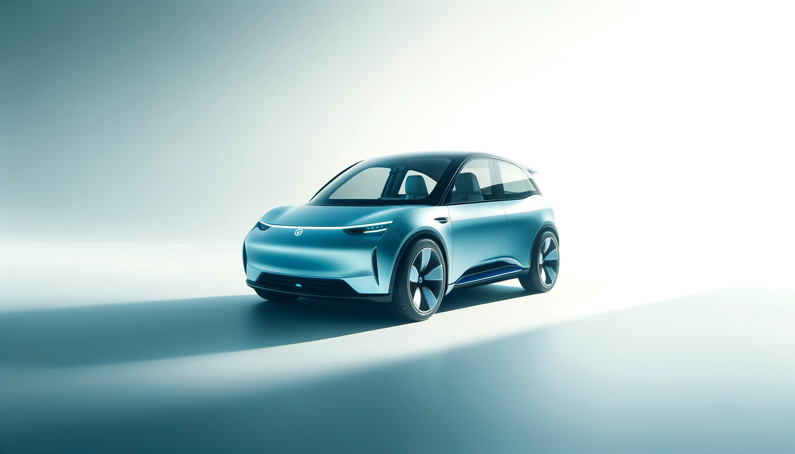

# **LLMotor MiniMax**

**Overview:** The MiniMax is LLMotor's compact, city-friendly electric vehicle, perfect for navigating bustling streets. Its efficient design maximizes interior space without compromising on style, making it an ideal choice for urban living.

- **Range:** 350 km per charge
- **Battery:** 50 kWh Lithium-ion
- **Price:** €30,000
- **Size:** Compact (4 seats)
- **Features:**
  - Regenerative braking system
  - Advanced infotainment system with AI-assisted navigation
  - Level 2 autonomous city driving features
  - Fast charging (80% in 30 minutes)
- **Available Colors:** Sky Blue, Pearl White, Matte Black
