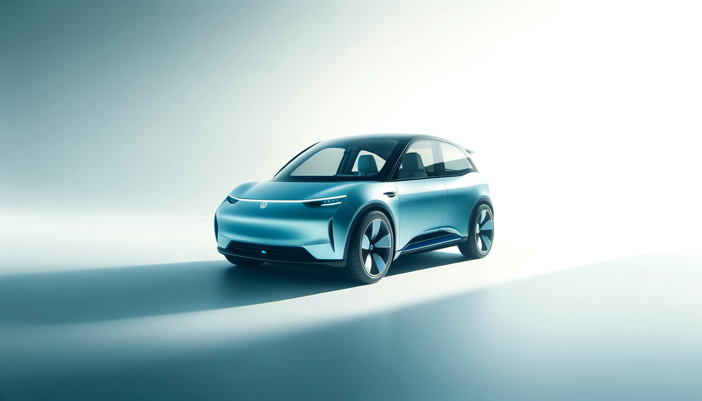
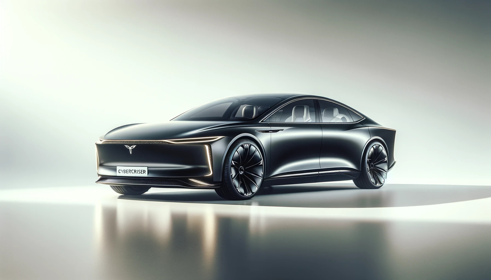

# LLMotor Catalog

## **1. LLMotor MiniMax**

**Overview:** The MiniMax is LLMotor's compact, city-friendly electric vehicle, perfect for navigating bustling streets. Its efficient design maximizes interior space without compromising on style, making it an ideal choice for urban living.

- **Range:** 350 km per charge
- **Battery:** 50 kWh Lithium-ion
- **Price:** €30,000
- **Size:** Compact (4 seats)
- **Features:**
  - Regenerative braking system
  - Advanced infotainment system with AI-assisted navigation
  - Level 2 autonomous city driving features
  - Fast charging (80% in 30 minutes)
- **Available Colors:** Sky Blue, Pearl White, Matte Black

---

## **2. LLMotor Terraformer**

**Overview:** Designed for the adventurer, the Terraformer brings an unmatched range and robust capabilities to tackle off-road challenges. This SUV is your gateway to exploring the countryside and beyond, blending performance with the spirit of adventure.

- **Range:** 500 km per charge
- **Battery:** 75 kWh Lithium-ion
- **Price:** €45,000
- **Size:** SUV (5 seats)
- **Features:**
  - All-wheel drive
  - AI-powered adaptive driving modes for optimal performance on any terrain
  - Panoramic sunroof for breathtaking views
  - Eco-friendly luxurious interior
  - Fast charging (80% in 45 minutes)
- **Available Colors:** Forest Green, Desert Sand, Ocean Blue

---

## **3. LLMotor CyberCruiser**

**Overview:** The CyberCruiser is the epitome of luxury and performance, showcasing LLMotor's cutting-edge technology. It's a symbol of future mobility, offering unparalleled speed and full autonomous driving capabilities, redefining the luxury sedan market.

- **Range:** 600 km per charge
- **Battery:** 100 kWh Lithium-ion
- **Price:** €70,000
- **Size:** Sedan (5 seats)
- **Features:**
  - Dual motor all-wheel drive for exceptional power and control
  - Accelerates from 0 to 100 km/h in 3.5 seconds
  - Level 4 autonomous driving technology
  - Premium interior with advanced noise cancellation
  - Integrated AI assistant for seamless in-car productivity
- **Available Colors:** Midnight Black, Silver Frost, Electric Blue
